```{r setup, include=FALSE}
options(htmltools.dir.version = FALSE)
library(tidyverse)
library(igraph)
library(ggraph)
library(patchwork)
library(graphlayouts)
library(kableExtra)

got_graphs <- readRDS("data/GoT/GoT.RDS")
lawyers <- readRDS("data/lawyers/lawyers.RDS")

got_palette <- c("#1A5878","#C44237","#AD8941","#E99093",
                 "#50594B","#DE9763","#5D5F5D","#E2E9E7")

help_console <- function(topic, format=c("text", "html", "latex", "Rd"),
                         lines=NULL, before=NULL, after=NULL) {  
  format=match.arg(format)
  if (!is.character(topic)) topic <- deparse(substitute(topic))
  helpfile = utils:::.getHelpFile(help(topic))

  hs <- capture.output(switch(format, 
                              text=tools:::Rd2txt(helpfile),
                              html=tools:::Rd2HTML(helpfile),
                              latex=tools:::Rd2latex(helpfile),
                              Rd=tools:::prepare_Rd(helpfile)
                              )
                      )
  if(!is.null(lines)) hs <- hs[lines]
  hs <- c(before, hs, after)
  cat(hs, sep="\n")
  invisible(hs)
}
```

```{r setup1, include=FALSE}
knitr::opts_hooks$set(fig.callout = function(options) {
  if (options$fig.callout) {
    options$echo <- FALSE
    options$out.height <- "99%"
    options$fig.width <- 16
    options$fig.height <- 8
  }
  options
})

reveal <- function(name, upto, highlight) {
content <- knitr:::knit_code$get(name)
  content[upto] <- gsub("+", "", content[upto], fixed=T)
  content[highlight] <- paste(content[highlight], "#<<")
  content[1:upto]
} 

```


class: title-slide middle center inverse   

# Network Visualization Workshop

### David Schoch 
Department of Sociology, University of Manchester  


.date[07/05/2019]

---

### about me

Presidential Fellow in Sociology  
academically grew up around "graph drawers"  
check out my blog (http://blog.schochastics.net) and twitter (@schochastics)

--

### schedule

**14:00 - 14:30**: A short introduction to network visualizations  
**14:30 - 15:30**: Introduction to visone  
**15:15 - 15:30**: Break  
**15:30 - 16:45**: Network visualization in R using [*ggraph*](https://github.com/thomasp85/ggraph), [*graphlayouts*](https://github.com/schochastics/graphlayouts) and [*snahelper*](https://github.com/schochastics/snahelper)  
**16:45 - 17:00**: Q&A and wrap-up

--

### prepared?

- downloaded visone and run it at least once?
- downloaded and installed R+Rstudio?

```{r install,eval=FALSE}
install.packages(c("igraph","ggraph","graphlayouts","remotes"))
remotes::install.github("schochastics/snahelper")
```


<!-- <canvas id="network" width="960" height="500" class="part canvasRight"> </canvas> -->

---
# ordinary data 
.left-code[
```{r mtcars,echo=FALSE,result="asis"}
mtcars %>% 
  head() %>% 
  knitr::kable(format='html')
```
]

---
# ordinary data 
.left-code[
```{r mtcars1,echo=FALSE,result="asis"}
mtcars %>% 
  head() %>% 
  knitr::kable(format='html') %>% 
  column_spec(c(2,4), bold = T,color = "white", background = "#660099")
```
]
```{r mtcars1-plot,echo=FALSE,eval=FALSE}
mtcars %>% 
  ggplot(aes(mpg,disp))+
  geom_point(size=4) + 
  theme_minimal() +
  theme(
    text = element_text(size = 24)
  )
```


.plot-callout[
```{r mtcars1-callout, ref.label="mtcars1-plot", fig.callout=TRUE}
```
]

---

# ordinary data 
.left-code[
```{r mtcars2,echo=FALSE,result="asis"}
mtcars %>% 
  head() %>% 
  knitr::kable(format='html') %>% 
  column_spec(2:4, bold = T,color = "white", background = "#660099")
```
]
```{r mtcars2-plot,echo=FALSE,eval=FALSE}
mtcars %>% 
  ggplot(aes(mpg,disp,col=factor(cyl)))+
  geom_point(size=4) + 
  theme_minimal() +
  theme(
    legend.position="none",
    text = element_text(size = 24)
  )
```


.plot-callout[
```{r mtcars2-callout, ref.label="mtcars2-plot", fig.callout=TRUE}
```
]

---

# ordinary data 
.left-code[
```{r mtcars3,echo=FALSE,result="asis"}
mtcars %>% 
  head() %>% 
  knitr::kable(format='html') %>% 
  column_spec(2:5, bold = T,color = "white", background = "#660099")
```
]
```{r mtcars3-plot,echo=FALSE,eval=FALSE}
mtcars %>% 
  ggplot(aes(mpg,disp,col=factor(cyl),size=hp))+
  geom_point() + 
  scale_size_continuous(range=c(3,9))+
  theme_minimal() +
  theme(
    legend.position="none",
    text = element_text(size = 24)
  )
```


.plot-callout[
```{r mtcars3-callout, ref.label="mtcars3-plot", fig.callout=TRUE}
```
]

---

# ordinary data 
.left-code[
```{r mtcars4,echo=FALSE,result="asis"}
mtcars %>% 
  head() %>% 
  knitr::kable(format='html') %>% 
  column_spec(c(3,6), bold = T,color = "white", background = "#660099")
```
]
```{r mtcars4-plot,echo=FALSE,eval=FALSE}
mtcars %>% 
  ggplot(aes(as.factor(cyl),drat))+
  geom_boxplot() + 
  theme_minimal() +
  theme(
    legend.position="none",
    text = element_text(size = 26)
  )+
  labs(x="cyl")
```


.plot-callout[
```{r mtcars4-callout, ref.label="mtcars4-plot", fig.callout=TRUE}
```
]

---
# network data
.pull-left[

```{r lawyersV,echo=FALSE,result="asis"}
lawyers %>% igraph::as_data_frame("vertices") %>% 
  head() %>% 
  knitr::kable(format = "html",row.names = F,caption = "Nodes")
```
]

.pull-right[
```{r lawyersE,echo=FALSE,result="asis"}
lawyers %>% igraph::as_data_frame("edges") %>% 
  head() %>% 
  knitr::kable(format = "html",row.names = F,caption = '<span class="circled">Edges</span>') %>% 
  kable_styling(full_width = F)
```
]

</br>
</br>

.center[**no prescribed way of placing nodes in the plane**]

---

# why visualizing networks is harder

**ordinary data**

- clear file format (spreadsheet, csv)
- clear data format (rows: observations, columns: variables)
- plot style dependent on variable scale (barchart, scatterplot,boxplot,...) 
- illustrate relations between variables
- given relative positions

**network data**

- many different file formats (csv,graphml,dot,dl,gexf,net,gdf,gml,nnf,sif,xgmml)
- different data formats (adjacency matrix,edgelist,adjaceny list,incidence matrix)
- how to choose a proper layout algorithm?
- can we draw any conclusions from a network plot?
- more degrees of freedom

---

# you still want to tell a story!

.pull-left[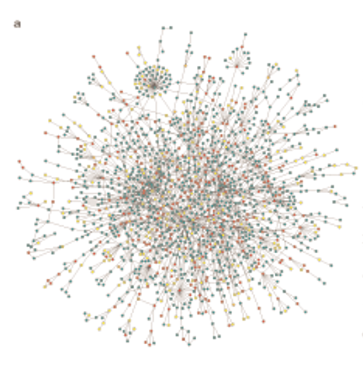]
.pull-right[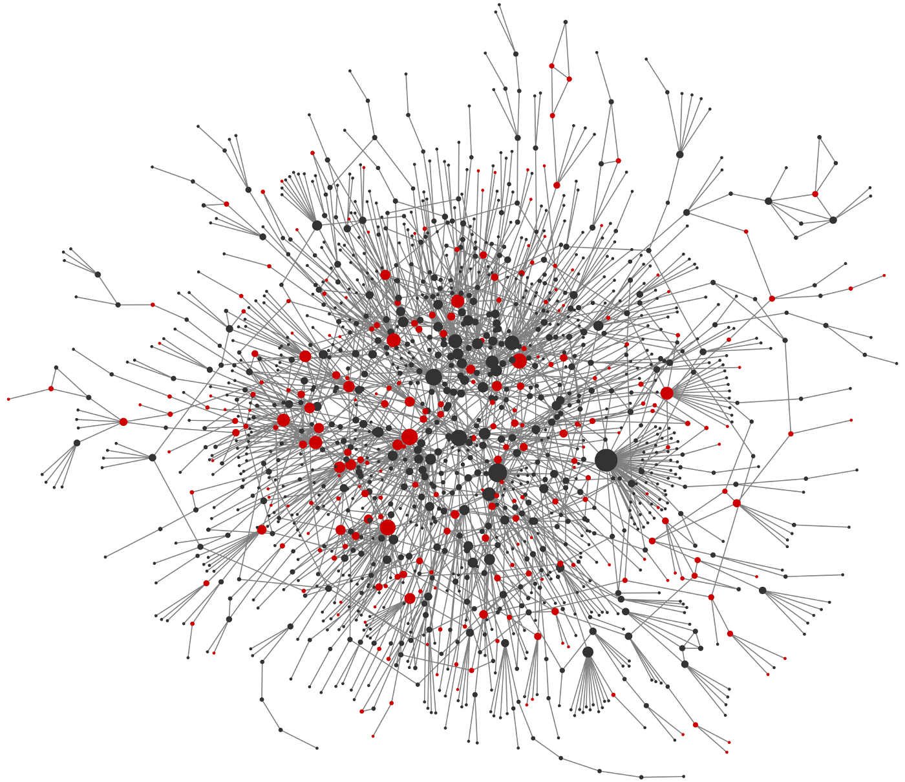]

---

# graph layouts
.pull-left[
```{r layouts,echo=FALSE}
p1 <- ggraph(lawyers,"circle")+
  geom_edge_link0(edge_colour="grey66")+
  geom_node_point(size=4,shape=21,aes(fill=as.factor(school)))+
  theme_graph()+
  theme(legend.position="none")
p2 <- ggraph(lawyers,"fr")+
  geom_edge_link0(edge_colour="grey66")+
  geom_node_point(size=4,shape=21,aes(fill=as.factor(school)))+
  theme_graph()+
  theme(legend.position="none")

p3 <- ggraph(lawyers,"lgl")+
  geom_edge_link0(edge_colour="grey66")+
  geom_node_point(size=4,shape=21,aes(fill=as.factor(school)))+
  theme_graph()+
  theme(legend.position="none")

p4 <- ggraph(lawyers,"nicely")+
  geom_edge_link0(edge_colour="grey66")+
  geom_node_point(size=4,shape=21,aes(fill=as.factor(school)))+
  theme_graph()+
  theme(legend.position="none")

p5 <- ggraph(lawyers,"stress")+
  geom_edge_link0(edge_colour="grey66")+
  geom_node_point(size=4,shape=21,aes(fill=as.factor(school)))+
  theme_graph()+
  theme(legend.position="none")

p6 <- ggraph(lawyers,"mds")+
  geom_edge_link0(edge_colour="grey66")+
  geom_node_point(size=4,shape=21,aes(fill=as.factor(school)))+
  theme_graph()+
  theme(legend.position="none")

p1+p2+p3+p4+p5+p6+plot_layout(nrow=2)
```
]

.pull-right[

**R**
```{r igraph_layouts,eval=FALSE}
c("layout_as_bipartite","layout_as_star", 
"layout_as_tree", "layout_in_circle", 
"layout_nicely","layout_on_grid", 
"layout_on_sphere", "layout_randomly", 
"layout_with_dh","layout_with_drl",
"layout_with_fr", "layout_with_gem", 
"layout_with_graphopt", "layout_with_kk", 
"layout_with_lgl", "layout_with_mds", 
"layout_with_sugiyama")
```

the layouts we want are not supported!
]
---

# graph layouts
**stress minimization**: "all purpose layout" which is .gold-highlight[deterministic]  

**backbone layout**: disentangle hairballs and enhance hidden group structures (.gold-highlight[if they exist])

**radial layouts**: centrality based drawings and .gold-highlight[ego networks]

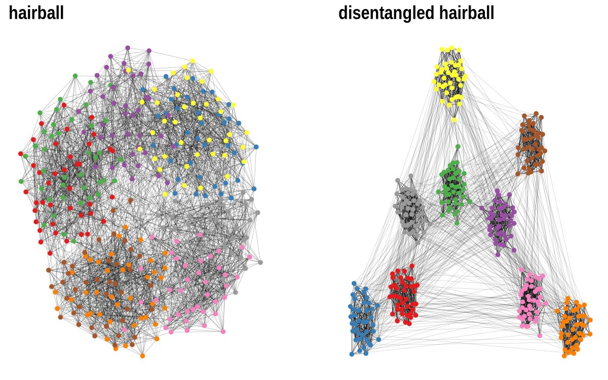
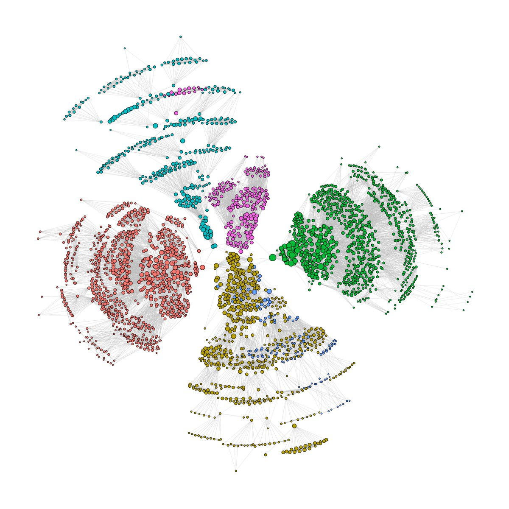
---

# colors, shapes et al.

.pull-left[
```{r rainbow_cols,fig.height=2.5,echo=FALSE}
n <- 100
image(1:n, 1, as.matrix(1:n), col = rainbow(n), 
      xlab = "", ylab = "", xaxt = "n", yaxt = "n", 
      bty = "n",main="forget about the rainbow")
```
]

.pull-right[
  
  [source](https://www.dataquest.io/blog/what-to-consider-when-choosing-colors-for-data-visualization/)
]

See this series on colors  
https://earthobservatory.nasa.gov/blogs/elegantfigures/2013/08/05/subtleties-of-color-part-1-of-6/

**at our disposal**

- node colors
- node sizes
- node shapes
- edge width
- edge colors
- edge linetypes

---

# two big no-no's

.pull-left[

]

.pull-right[
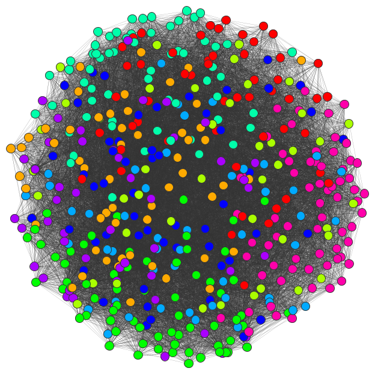
]
---

# two big no-no's 

.pull-left[
```{r curved-edges,echo=FALSE}
ggraph(lawyers,"stress")+
  geom_edge_arc(edge_colour="grey66")+
  geom_node_point(size=4,shape=21,aes(fill=as.factor(school)))+
  theme_graph()+
  theme(legend.position="none",
        plot.title = element_text(size=24))+
  labs(title="no curved edges!")
```
]

--

.pull-right[
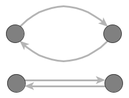
]

---

#one smallish no-no

.pull-left[
  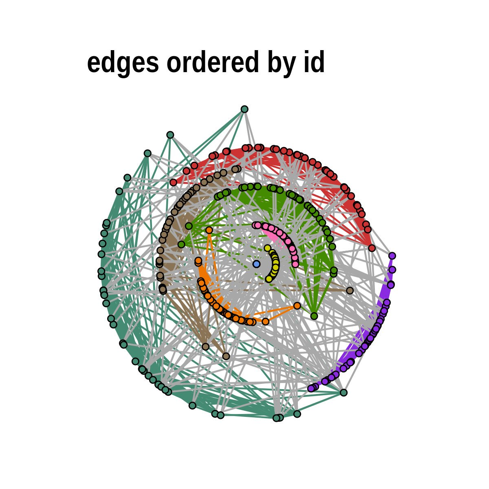
]

--

.pull-right[
  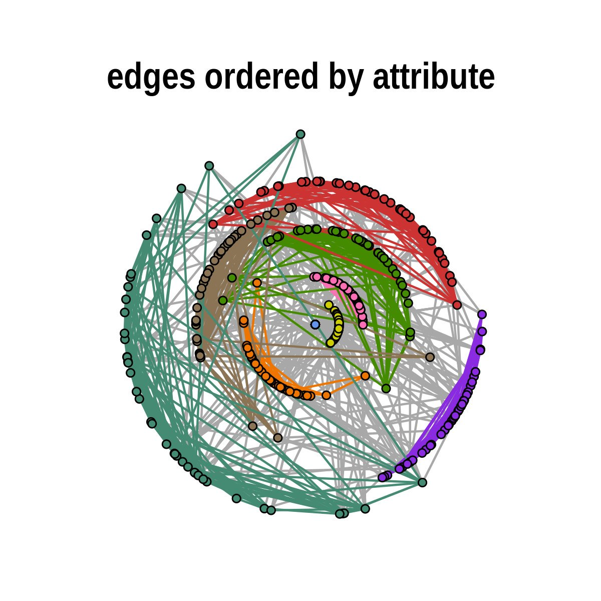
]

---

# Tools

**Software**

- UCINET .cite[https://sites.google.com/site/ucinetsoftware/home]
- Gephi .cite[https://gephi.org/]
- .gold-highlight[visone] .cite[http://visone.info/]
- Graphviz .cite[https://www.graphviz.org/]
- Cytoscape .cite[https://cytoscape.org/]
- Pajek .cite[http://mrvar.fdv.uni-lj.si/pajek/]
- NodeXL .cite[https://www.smrfoundation.org/nodexl/]
- ...

**Libraries**

- NetworkX (Python) .cite[http://networkx.github.io/]
- igraph (R, Python Mathematica) .cite[https://igraph.org/]
- ...

**Programming environments**

- Python
- .gold-highlight[R]

---

class: title-slide middle center inverse   

# Network Visualization in visone


---

class: title-slide middle center inverse   

# Network Visualization in R

---

# Networks in R

**why R?**

- independent package development vs. centralized software development
- don't start the Python vs. R fight
- the R community is awesome! (twitter: #rstats, #RLadies; https://www.r-bloggers.com)

--

**R packages for networks**

- .gold-highlight[igraph]
- statnet
- .gold-highlight[ggraph]
- tidygraph 
- .gold-highlight[graphlayouts]
- .gold-highlight[snahelper]
- network
- ergm
- netrankr
- egor
- ...

---
# How to get your network into R

**network fileformats **
```{r load_netdata1,eval=FALSE}
?read.graph
```

.small[
```{r load_netdata,echo=FALSE,results='asis'}
help_console(read.graph, "html", lines = 1:25, before = "<blockquote>", after = "</blockquote>")
```
]

---

# How to get your network into R

**network fileformats **
```{r load_netdata_graphml}
g <- read.graph("data/GoT/gotS1.graphml",format="graphml")
g
```

---

# How to get your network into R

**Adjacency matrices ** (check fileformat!!!)
.center[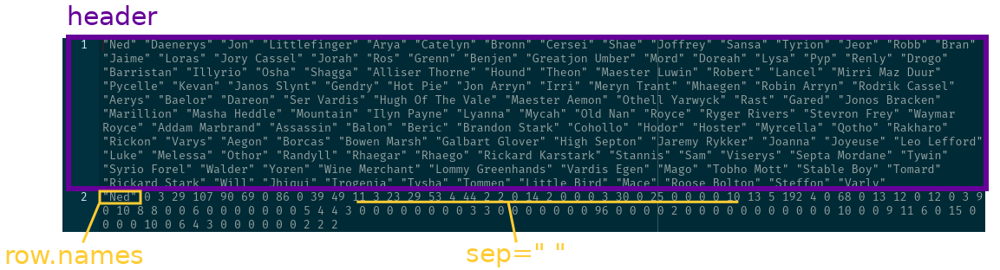]
```{r load_amat1}
A1 <- read.table("data/GoT/gotS1_matrix.dat", header = T, row.names = 1, sep = " ")
A1 <- as.matrix(A1)
A1[1:2,1:8]
```

---

# How to get your network into R

**Adjacency matrices ** (check fileformat!!!)
.center[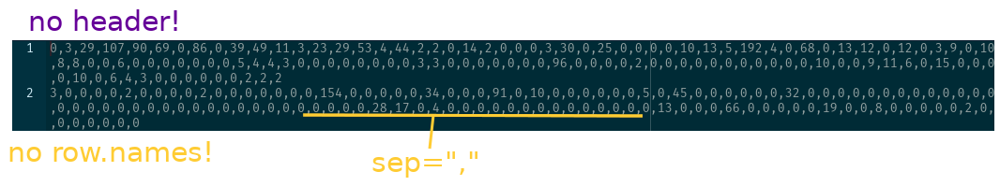]
```{r load_mat2}
A2 <- read.table("data/GoT/gotS1_matrix1.dat",header = F,sep=",")
A2 <- as.matrix(A2)
A2[1:2,1:8]
```

---

```{r adj_mat}
g1 <- graph_from_adjacency_matrix(A1,mode="undirected",weighted = T)
igraph::print.igraph(g1,max.lines = 4)
```


```{r adj_mat1}
g2 <- graph_from_adjacency_matrix(A2,mode="undirected",weighted = T)
igraph::print.igraph(g2,max.lines = 4)
```

---
# How to get your network into R

**other formats**

```{r edgl,eval=FALSE}
graph_from_edgelist(el,directed = TRUE/FALSE)
graph_from_adj_list(adjlist,mode = "all"/"in"/"out")
graph_from_data_frame(d,directed = TRUE/FALSE,vertices) 
```

**example** (taken from https://kateto.net/networks-r-igraph)

```{r}
edges <- read.table(file = "data/media/Dataset1-Media-Example-EDGES.csv",sep=",",header=T)
nodes <- read.table(file = "data/media/Dataset1-Media-Example-NODES.csv",sep=",",header=T)
net <- graph_from_data_frame(d = edges,directed=TRUE,vertices=nodes)
net
```


---
# "naive" plotting
```{r igraph_plot,eval=FALSE}
plot(g)
```

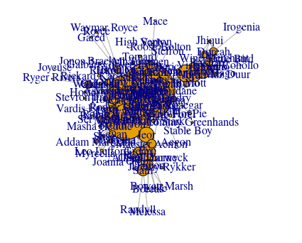

igraph tutorial by Katherine Ognyanova (https://kateto.net/networks-r-igraph)

---

# grammar of graphics

<blockquote>
A grammar of graphics is a framework which follows a layered approach to describe and construct visualizations or graphics in a structured manner. 
</blockquote>
(think Photoshop, also see http://vita.had.co.nz/papers/layered-grammar.pdf)  

.center[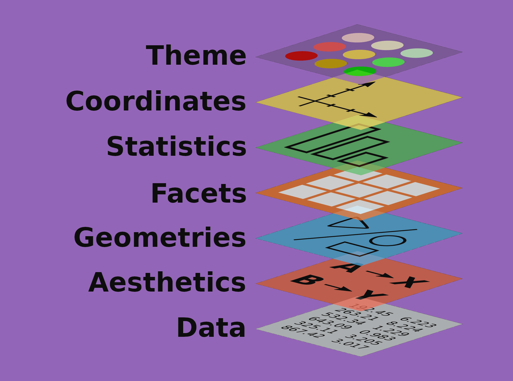]

---

# ggraph ("ggplot for networks")  


/dʒiː.dʒɪˈrɑːf/ (or g-giraffe)  
`layout` + `edge layer` + `node layer` + `edge scales` + `node scales` + `theme`

```{r load_packdata}
library(igraph)
library(ggraph)
library(graphlayouts)

got_graphs <- readRDS("data/GoT/GoT.RDS")
```

**layouts**
```{r ggraphlayouts,eval=FALSE}
#stress minimization
ggraph(got_graphs[[1]],layout="stress")

# radial centrality
ggraph(got_graphs[[1]],layout="centrality",cent = degree(got_graphs[[1]]))

```


---

# the ggraph package "geoms"

**node geoms**
```{r geom_node,eval=FALSE}
c("geom_node_arc_bar", "geom_node_circle", "geom_node_label", 
"geom_node_point", "geom_node_text", "geom_node_tile", "geom_node_treemap")
```


**edge geoms**
```{r geom_edge, eval=FALSE}
c("geom_edge_arc", "geom_edge_arc0", "geom_edge_arc2", "geom_edge_density", 
"geom_edge_diagonal", "geom_edge_diagonal0", "geom_edge_diagonal2", 
"geom_edge_elbow", "geom_edge_elbow0", "geom_edge_elbow2", "geom_edge_fan", 
"geom_edge_fan0", "geom_edge_fan2", "geom_edge_hive", "geom_edge_hive0", 
"geom_edge_hive2", "geom_edge_link", "geom_edge_link0", "geom_edge_link2", 
"geom_edge_loop", "geom_edge_loop0")
```

--

Most likely, you will only ever need .gold-highlight[`geom_edge_link0`] and .gold-highlight[`geom_node_point`] together with .gold-highlight[`geom_node_text`]

---

#"aes(thetics)" and scales

.pull-left[
```{r edge_attr}
edge_attr_names(got_graphs[[1]])
```
]

.pull-right[
```{r vertex_attr}
vertex_attr_names(got_graphs[[1]])
```
]

map variables to aesthetics with **aes()**

.fake-code[geom_edge_link0(.gold-highlight[aes(edge_width=Weight)],edge_colour="grey66")  ]
.fake-code[geom_node_point(.gold-highlight[aes(fill=clu,size=size)],shape=21,colour="grey25")] 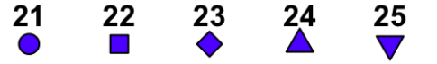

change appearances with **scale_* **

.fake-code[
scale_edge_width_continuous(range=c(0.1,1.5))  
scale_size_continuous(range=c(1,8))  
scale_fill_manual(values=got_palette)
]


---

```{r complete, eval=F, echo=F}
ggraph(got_graphs[[1]],layout = "stress")+
geom_edge_link0(aes(edge_width=Weight),
                edge_colour="grey66")+
geom_node_point(aes(fill=clu,size=size),
                shape=21,col="grey25")+
scale_edge_width_continuous(range=c(0.1,1.5))+
scale_size_continuous(range=c(1,8))+
scale_fill_manual(values=got_palette)+
theme_graph()+
theme(legend.position = "none")
```

```{css, echo=FALSE}
.remark-code{ line-height: 2; }
```

.pull-left[
```{r plot1, eval=FALSE, code=reveal("complete", 1, 1)}
```
]
.net-callout[
```{r output1, echo=FALSE, code=reveal("complete", 1, 1)}
```
]

---

.pull-left[
```{r plot2, eval=FALSE, code=reveal("complete", 3, c(2,3))}
```
]
.net-callout[
```{r output2, echo=FALSE, code=reveal("complete", 3, c(2,3))}
```
]

---

.pull-left[
```{r plot3, eval=FALSE, code=reveal("complete", 5, c(4,5))}
```
]
.net-callout[
```{r output3, echo=FALSE, code=reveal("complete", 5, c(4,5))}
```
]

---

.pull-left[
```{r plot5, eval=FALSE, code=reveal("complete", 6,6)}
```
]
.net-callout[
```{r output5, echo=FALSE, code=reveal("complete", 6, 6)}
```
]

---

.pull-left[
```{r plot6, eval=FALSE, code=reveal("complete", 7,7)}
```
]
.net-callout[
```{r output6, echo=FALSE, code=reveal("complete", 7, 7)}
```
]

---

.pull-left[
```{r plot7, eval=FALSE, code=reveal("complete", 8,8)}
```
]
.net-callout[
```{r output7, echo=FALSE, code=reveal("complete", 8, 8)}
```
]

---

.pull-left[
```{r plot8, eval=FALSE, code=reveal("complete", 9,9)}
```
]
.net-callout[
```{r output8, echo=FALSE, code=reveal("complete", 9, 9)}
```
]

---

.pull-left[
```{r plot9, eval=FALSE, code=reveal("complete", 10,10)}
```
]
.net-callout[
```{r output9, echo=FALSE, code=reveal("complete", 10, 10)}
```
]

---
# some more examples

**node labels**
```{r node_labels,eval=FALSE}

V(got_graphs[[1]])$rank <- rank(-V(got_graphs[[1]])$size)
  
ggraph(got_graphs[[1]],layout = "stress")+
  geom_edge_link0(aes(edge_width = Weight),
                  edge_colour = "grey66")+
  geom_node_point(aes(fill=clu,size=size),
                  shape = 21,col = "grey25")+
  {{geom_node_text(aes(filter = (rank<=10),label = name),size = 7,repel = TRUE)}}+
  scale_edge_width_continuous(range = c(0.1,1.5))+
  scale_size_continuous(range = c(1,8))+
  scale_fill_manual(values = got_palette)+
  theme_graph()+
  theme(legend.position = "none")
```

---

```{r node_labels-callout, ref.label="node_labels", fig.callout=TRUE}
```

---

# some more examples

**radial layout** ("focused")

```{r radial_got,eval=FALSE}
{{ggraph(got_graphs[[1]],layout = "focus",v = 1)}}+
  {{draw_circle(use = "focus",max.circle = 3)}}+
  geom_edge_link0(aes(edge_width = Weight),
                  edge_colour = "grey66")+
  geom_node_point(aes(fill=clu,size=size),
                  shape = 21,col = "grey25")+
  geom_node_text(aes(filter = (rank<=10),label = name),size = 7,repel = TRUE)+
  scale_edge_width_continuous(range = c(0.1,1.5))+
  scale_size_continuous(range = c(1,8))+
  scale_fill_manual(values = got_palette)+
  {{coord_fixed()}}+
  theme_graph()+
  theme(legend.position = "none")
```

---

```{r radial_got-callout, ref.label="radial_got", fig.callout=TRUE}
```

---

# some more examples 

**radial layout** ("centrality")
```{r radialc_got,eval=FALSE}
bc <- betweenness(got_graphs[[1]])
{{ggraph(got_graphs[[1]],layout = "centrality",cent = bc)}}+
{{draw_circle(use = "cent")}}+
  geom_edge_link0(aes(edge_width = Weight),
                  edge_colour = "grey66")+
  geom_node_point(aes(fill=clu,size=size),
                  shape = 21,col = "grey25")+
  geom_node_text(aes(filter = (rank<=10),label = name),size = 7,repel = TRUE)+
  scale_edge_width_continuous(range = c(0.1,1.5))+
  scale_size_continuous(range = c(1,8))+
  scale_fill_manual(values = got_palette)+
  {{coord_fixed()}}+
  theme_graph()+
  theme(legend.position = "none")
```

---

```{r radialc_got-callout, ref.label="radialc_got", fig.callout=TRUE}
```

---
class: middle center


---

# Enter snahelper

.pull-left[
```{r eval=FALSE}
#install.packages(remotes)
library(remotes)
install_github("schochastics/snahelper")
```

 
]

--
.pull-right[

]

---

class: title-slide middle center inverse   

# Wrap up

---

# organize your own data!

.box[
**nodes**  
a table where each row represents a node with its attributes (use .circled[headers]):  

|name|gender|age|category|
|--|--|--|--|
|Person A|1|34|Friend|
|Person B|0|42|Family|
]
</br>  
.box[
**edges**  
a table where each row represents an edge with its attributes (use same names as for nodes):  

|from|to|weight|
|--|--|--|
|Person A|Person B|12|
]

possibly a codebook for attributes

--

.center[**the more you organize the easier the analysis/visualization**]

---

## piece of cake 🎂

**in R**
```{r readexample,eval=FALSE}
nodes <- read.table("nodes.csv",header = TRUE,sep = ",")
edges <- read.table("edges.csv",header = TRUE,sep = ",")
g <- graph_from_data_frame(edges,directed = FALSE, vertices = nodes)
🥳🥳🥳

```

**visone**

- open your `edges.csv` file
- go to attribute manager 
- import `nodes.csv`
- 🥳🥳🥳

---

# if not...

.center[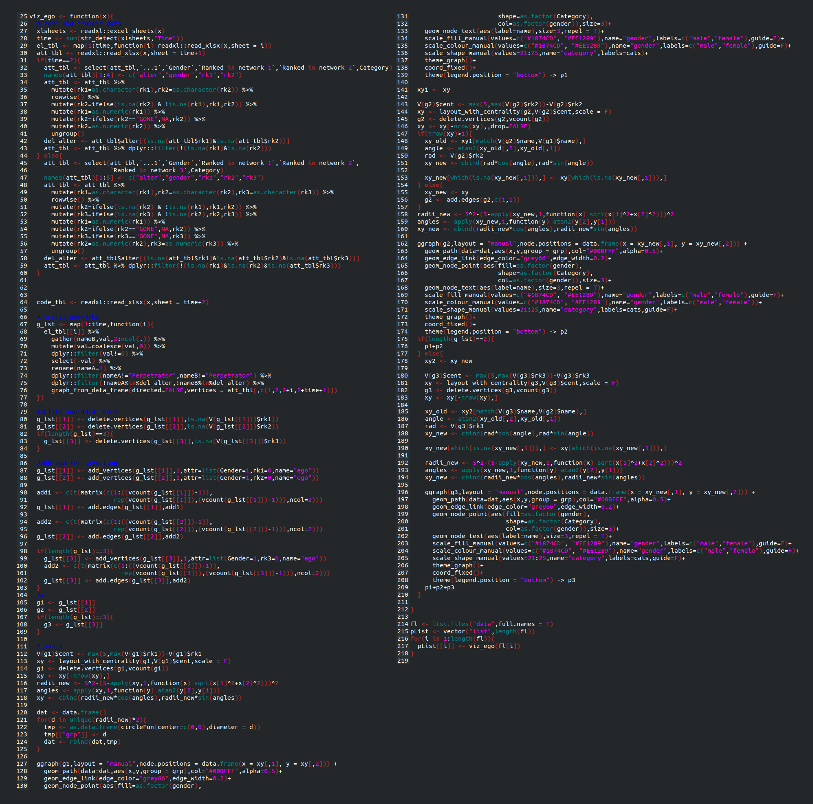]

